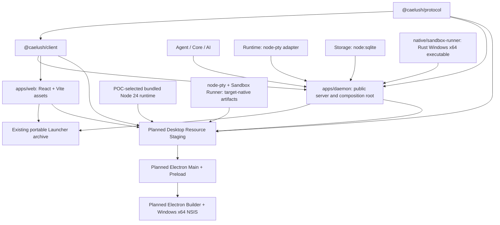

# Desktop Build Graph and D0-C POC Gate

- **Round:** Caelush Desktop & Cloud — D0-B
- **First target:** Windows x64
- **Current repository Node requirement:** Node.js `>=24.0.0 <25.0.0`
- **Desktop installer status:** not implemented

## Current build graph

The current dependency direction remains a DAG: low-level Protocol is used by
Client and app hosts; `apps/daemon` composes Agent/Core/AI/Runtime/Storage and
the other runtime packages; Web consumes the public Client/Protocol; Launcher
starts the existing Daemon entry. No Desktop package, Electron shell, or
Cloud repository exists in this checkout.

| Step                              | Current status                                       | Source / contract                                                                   |
| --------------------------------- | ---------------------------------------------------- | ----------------------------------------------------------------------------------- |
| Protocol and package graph        | Existing                                             | `packages/protocol`, `packages/client`, and workspace dependencies                  |
| Agent production assembly         | Existing; Daemon is the only root                    | `apps/daemon/src/daemon.ts`, `apps/daemon/src/daemon-composition.ts`                |
| Web production bundle             | Existing `vite build` step                           | `apps/web/package.json`; emits `apps/web/dist`                                      |
| Daemon storage                    | Existing; `node:sqlite` `DatabaseSync`               | `packages/storage/src/database.ts`                                                  |
| PTY runtime                       | Existing; lazily imports `node-pty` and spawns a PTY | `packages/runtime/src/exec/pty-process-adapter.ts`, `packages/runtime/package.json` |
| Sandbox Runner                    | Existing Rust source and release helper              | `native/sandbox-runner`, `scripts/build-sandbox-runner.mjs`                         |
| Portable release workspace        | Existing; pnpm deployment archive                    | `scripts/build-release.mjs`                                                         |
| Desktop resource staging          | Not present                                          | D6-A–D6-B                                                                           |
| Electron Main / Preload           | Not present                                          | D3-A–D3-B                                                                           |
| Electron Builder / NSIS installer | Not present; no dependency or command                | D6-A–D6-B                                                                           |

## Existing portable release path

`scripts/build-release.mjs` packages the existing Launcher deployment as
`caelush-v<version>-<platform>-<arch>.tgz`. It creates a pnpm production
deployment, flattens injected workspace dependencies, copies the prebuilt Web
assets into the deployed `web/` directory, rewrites workspace package
metadata, and writes a Release Manifest and archive checksums. The script
requires `apps/web/dist/index.html` to exist first. On Windows it packages the
Sandbox Runner by default and records its identity/hash. The manifest declares
Node range `>=24.0.0 <25.0.0` and Daemon Protocol version `1`; the archive does
not bundle a Node executable. The release version is read from the deployed
Launcher `package.json`.

This is a portable Node workspace release, not an Electron application or
Windows installer. D0-B does not modify it, run it, replace it, or introduce
Electron Builder, NSIS, ASAR rules, or a Desktop package.

## Desktop resources that must be staged

The future Desktop bundle needs an explicit resource stage before installer
creation:

1. Production Web static assets, with a stable Web asset identity tied to the
   controlled product release.
2. The existing Daemon entry and all runtime package production dependencies.
3. A Node runtime strategy that supports `node:sqlite` and `node-pty` when the
   machine has no separately installed Node.js.
4. Platform-matched native dependencies: `node-pty` and the Windows x64 Rust
   Sandbox Runner.
5. A JSON-safe Desktop Resource Manifest that binds the release to its
   resources.
6. Electron Main and Preload; Renderer embeds or loads the staged existing Web
   application.

The future Resource Manifest must identify at least:

| Field group         | Required identity                                                                                        |
| ------------------- | -------------------------------------------------------------------------------------------------------- |
| Product release     | product version, `dev`/`beta`/`stable` channel, Windows platform, x64 architecture                       |
| Daemon contract     | Daemon version, API version, Protocol version, required capability list                                  |
| Web                 | asset identity and SHA-256 or SHA-512 digest                                                             |
| Node runtime        | product version, platform/architecture, executable identity and digest, when separately bundled          |
| Native dependencies | name, version, platform, architecture, Node/Electron ABI or N-API identity where applicable, file digest |
| Sandbox Runner      | control protocol version, platform/architecture, provider/capability set, executable digest              |
| Resource set        | deterministic manifest schema/version and content digests                                                |

These are required data concepts, not a signed or generated manifest. D6 owns
the final schema, signature, staging layout, ASAR/unpack policy, and installer
binding. The legacy portable Release Manifest remains a separate contract.

## Runtime and native compatibility risks

The workspace targets Node 24. Storage imports the built-in `node:sqlite`
`DatabaseSync`; Runtime lazily loads the external `node-pty` native module;
the restricted Sandbox Runner is a separately built Rust executable. Electron
has its own Node runtime and ABI. The presence of `node:sqlite` in one runtime
does not prove that the Electron-bundled version, Daemon child runtime, or
`node-pty` binary is compatible.

| Concern                          | D0-C measured evidence                                                                       | Status / owner                                                                                                               |
| -------------------------------- | -------------------------------------------------------------------------------------------- | ---------------------------------------------------------------------------------------------------------------------------- |
| Daemon `node:sqlite`             | Real packaged Daemon opened SQLite; migration created 32 tables; integrity returned `ok`     | Data recovered after owned-child termination; graceful-close/reopen path remains `BLOCKED — D0-C`                            |
| `node-pty`                       | `node-pty@1.1.0` passed Windows x64 PTY I/O/cancel/close under bundled Node 24.18.0          | Pass; the same native module loaded under Electron Node 24.21.0 in the bounded embedded-runtime probe                        |
| Rust Sandbox Runner              | Packaged x64 PE and manifest hash verified; real workspace protocol and restricted child ran | Pass with `PARTIAL` Windows ACL enforcement; clean-host test and reproducible MSVC rebuild remain open                       |
| Electron Node vs standalone Node | Electron 44.7.0 exposed Node 24.21.0; ESM, `node:sqlite`, and bounded PTY probe passed       | D0-C selects bundled Node 24.18.0 for Daemon; full Daemon-on-Electron-Node execution remains deferred                        |
| ASAR and native extraction       | No Electron packaging config exists                                                          | `asarUnpack`, `extraResources`, executable permissions, runtime path resolution and hash checks: D0-C POC, D6 implementation |
| Authenticode                     | No Desktop installer exists                                                                  | Publisher verification and signed installer update path: D6/D7                                                               |

The build host must match target Windows x64 requirements for native artifacts.
D0-C should verify the actual compiler/toolchain and ABI rather than infer them
from package metadata. Native binaries must not be loaded from an unchecked
or mutable workspace directory.

## D0-C Windows x64 POC acceptance

The POC should exercise the smallest vertical startup without building a
product installer:

1. On a clean Windows x64 test host with no global Node installation, start a
   packaged Desktop-owned Daemon through the selected Node runtime strategy.
2. Confirm the Daemon opens a disposable profile SQLite database using
   `node:sqlite`, applies existing migrations, shuts down, and can reopen it.
3. Confirm `node-pty` loads and can spawn, stream, cancel, and close a bounded
   test process under the chosen Node/Electron ABI.
4. Confirm the Windows x64 Sandbox Runner binary is located outside the
   workspace, matches its manifest digest, and passes the existing Daemon
   startup/diagnostic path.
5. Serve the existing Web assets, execute the `/api/v1/health` and `/info`
   handshake, exercise one Session/Run request with a local fixture, and
   reconnect an SSE stream using the durable cursor.
6. Verify process ownership, ephemeral loopback binding, private bootstrap
   transport feasibility, generation invalidation on restart, request
   cancellation, and bounded shutdown.
7. Record exact Node/Electron versions, OS build, compiler/toolchain, native
   module ABI, binary hashes, and every limitation. Do not call a build or
   feature complete if a step was skipped.

D0-C is a technical feasibility gate, not product functionality. A failing POC
must produce a concrete runtime/ABI decision before D3/D4/D6 implementation.
The production resource stage, ASAR layout, NSIS installer, upgrade path,
Authenticode release, and automatic update remain D6/D7.

## D0-C POC outcome

The D0-C evidence is recorded in
[`d0-c-windows-feasibility-report.md`](d0-c-windows-feasibility-report.md).
The selected POC runtime is the separately bundled Node 24.18.0 executable.
The packaged fixture passed Node startup, PTY, Runner protocol/restricted-child,
and Web/Daemon/SSE checks. D0-C remains **PARTIAL** because normal Daemon
shutdown did not acknowledge within the bounded 20-second POC deadline and no
clean Windows VM or Windows Sandbox was available. The database passed
integrity and restart-recovery checks, but those facts do not turn the blocked
graceful-shutdown gate into a pass.
